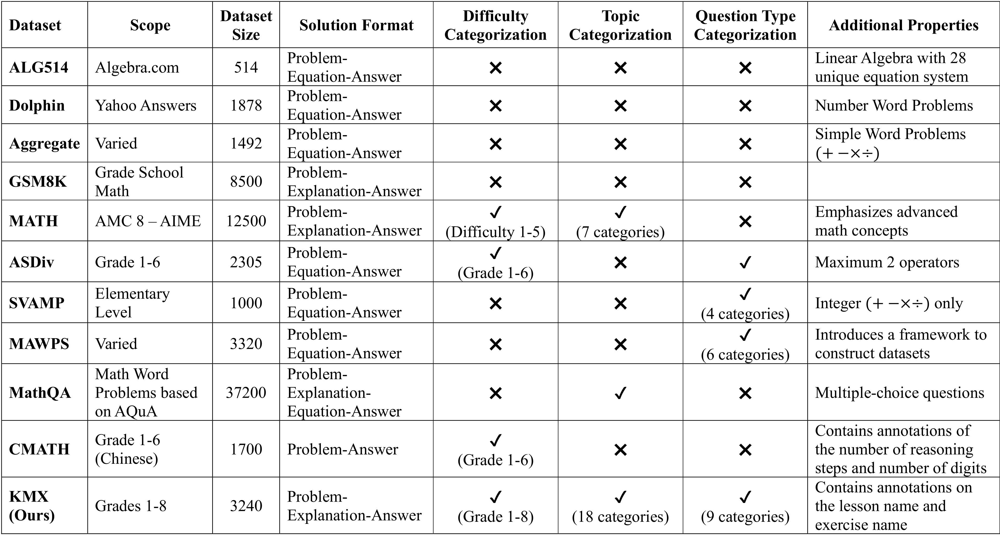

# KMX Dataset
## Unraveling the Complexity of Math Problems with the KMX Dataset

Mathematical reasoning is a crucial aspect in evaluating human cognition and is a crucial part of many decision-making tasks. While current datasets focus on a narrow set of topics or question types, the KMX(Khan-Math-X) dataset is a comprehensive and diverse set of problems that is annotated with additional dimensions such as grade level, exercise names, and question types. This allows for more fine-grained analysis of model performance. We assess the performance of several models using various techniques and show that while certain methods improve performance across the board, their effectiveness varies significantly depending on the model and problem type, revealing the intricacies when dealing with different mathematical tasks. The KMX dataset enables a more nuanced understanding of model strengths and weaknesses, and offers a valuable resource for future research in mathematical reasoning.



## Dataset Details
The KMX (Khan-Math-X) dataset adheres to some design principles that are aimed at targeting gaps in current datasets. 

- **Alignment with Educational Standards**: The KMX dataset is designed to comprehensively represent real-world math problems sourced from the Khan Academy curriculum. Each problem is carefully annotated with grade, unit, lesson, and topic to ensure educational relevance and to facilitate fine-grained performance evaluation across a broad range of math skills.
- **Diversity and Depth for Robust Evaluation**: To support in-depth analysis, the dataset encompasses a variety of question types, including word problems and mathematical expressions, categorized into 18 distinct topics, and 9 question types. We strive to have a large distribution of math topics and question types available so that a more holistic understanding of models' numerical reasoning capabilities can be accessed.
- **Smooth Progression for Model Evaluation**: The dataset is designed to accommodate a wide range of models, from the weakest to the most advanced. We aim for a smooth gradient in problem difficulty to ensure that high-performing models can excel, while lower-performing models still demonstrate meaningful progression. This approach provides researchers with a clear understanding of each model’s strengths and weaknesses, facilitating more precise benchmarking across different levels of model capability.
- **Ease of Use**: The KMX dataset is formatted to be readily usable by a wide range of models, with problems provided in a standardized, human-readable format. Additionally, each problem is accompanied by natural language, step-by-step solutions, making it easier for both models and researchers to interpret the reasoning behind the answers.

<center>

| Feature              | Value |
| :---------------- | :------: |
| Number of Problems        |   3240   |
| Unique Grades           |   8   |
| Unique Unit Names    |  34   |
| Unique Lesson Names    |  102   |
| Unique Exercise Names |  149   |
| Unique Topics           |   18   |
| Unique Question Types    |  9   |

</center>

The grade, unit names, lesson names and exercise names are sourced from Khan Academy. The topics and question types have been annotated to be aligned with the Math syllabus.

The data has been split into 2285 training problems and 955 test problems. They can be found in 
- [data/kmx_train.csv](data/kmx_train.csv)
- [data/kmx_test.csv](data/kmx_test.csv)


## Experiments
Sample scripts are provided in [scripts/](scripts/) to perform any experiments on the KMX dataset.

Relevant files:
- **finetune.py**: Performs fine-tuning on existing models. Accepts a [config file](scripts/finetune_config.json) for hyperparmeters.
- **inference.py**: Performs generation on a language model. Contains options to include various in-context-learning prompts.
- **inf_calc.py**: Performs generation on a language model that has been trained with the appropriate calculator tags
- **evaluate.py**: Parses the generated output and converts it into an answer that can be used to evaluate correctness

Full experimental results and discussions can be seen in the paper.

### Models Available
A list of possible models, and the corresponding string required when running the respective python scripts. Note that the GPT experiments are conducted through the openAI API.
| Model            | model-name        |
|:-----------------|:------------------|
| DeepSeekMath     | deepseekmath-7b   |
| Falcon           | falcon-7b         |
| Gemma            | gemma-2b          |
| Llama 3          | llama3-8b         |
| Llama 3.1        | llama3_1-8b       |
| Mathstral        | mathstral-7b      |
| MetaMath-Mistral | metamathmistral-7b|
| Mistral          | mistral-7b        |
| Phi-2            | phi-2             |
| Qwen             | qwen-7b           |
| Rho              | rho-1b            |
| TinyLlama        | tinyllama         |
| Vicuna           | vicuna-7b         |
| WizardMath       | wizardmath-7b     |
| Zephyr           | zephyr-3b         |

### Fine-tuning
To fine-tune a model (Experiments 3-6), the [scripts/finetune.py](scripts/finetune.py) file is utilised with the following parameters.
```
python finetune.py [datafile] [config] [output] [-use_topic] [-use_calculator] [model_dir]
```

| Argument       | Default | Comment                                                                                             |
|----------------|---------|-----------------------------------------------------------------------------------------------------|
| datafile       |         | Path to `kmx_train.csv`                                                                             |
| config         |         | Path to `finetune_config.json`                                                                      |
| output         |         | Directory to save fine-tuned model                                                                  |
| use_topic      | False   | Whether to include identification of exercise name (Experiment 6)                           |
| use_calculator | False   | Whether to create tokenization for calculator tags (Experiment 4 and 5)                     |
| model_dir      |         | (Optional) If training a model from an existing model directory, this is the path to that directory |


To change the model and other hyperparameters related to the fine-tuning process, change the [finetune_config.json](finetune_config.json) file.


### Inference
To perform an inference of a model, whether it is in-context learning (Experiments 1 and 2) or after fine-tuning (Experiments 3 and 6), the [scripts/inference.py](scripts/inference.py) file is utilised with the following parameters.
```
python inference.py [datafile] [output] [model] [model_dir] [batch_size] [max_length] [append_to_prompt] [-greedy] [run_num]
```
| Argument | Default | Comment |
|---|---|---|
| datafile |  | Path to `kmx_test.csv` |
| output |  | Directory to save the generated output (as a csv file) |
| model |  | Name of model being used |
| model_dir |  | (For fine-tuned models) Directory containing the desired model |
| batch_size | 8 | Batch size for generation |
| max_length | 250 | Maximum number of additional tokens generated |
| append_to_prompt | none | What to append to the prompt, if any. 'base' for ICL without CoT, 'cot' for ICL with CoT, 'none' otherwise |
| -greedy | False | Whether to use greedy decoding |
| run_num | 0 | Run number. Helps to distinguish outputs if generating with self-consistency |

### Inference (Calculator)
For the experiments involving an external calculator (Experiments 4 and 5), the [scripts/inf_calc.py](scripts/inf_calc.py) file is used instead withe the following parameters. 
```
python inf_calc.py [datafile] [output] [model] [model_dir] [batch_size] [max_length] [-greedy] [run_num]
```
| Argument | Default | Comment |
|---|---|---|
| datafile |  | Path to `kmx_test.csv` |
| output |  | Directory to save the generated output (as a csv file) |
| model |  | Name of model being used |
| model_dir |  | (For fine-tuned models) Directory containing the desired model |
| batch_size | 8 | Batch size for generation |
| max_length | 512 | Maximum number of additional tokens generated |
| -greedy | False | Whether to use greedy decoding |
| run_num | 0 | Run number. Helps to distinguish outputs if generating with self-consistency |

### Evaluation
After generating the output via the respective inference script, the [scripts/evaluate.py](scripts/evaluate.py) file is utilised to extract the answer and evaluate it against the actual answer.

```
python evaluate.py [results_folder] [technique] [model] [output] [run_num]
```
| Argument | Default | Comment |
|---|---|---|
| results_folder |  | Path to the parent results folder |
| technique |  | Name of the technique applied, serves as the child folder that contains the generated csv |
| model |  | Name of model being used |
| output |  | Path to a consolidated output file of all results |
| run_num | 0 | Run number. Performs the evaluation on the specific run number |


### Example Usage
**Example 1: In-context learning with chain-of-thought reasoning (ICL with CoT) and greedy decoding generation**  

```
python inference.py --datafile "../data/kmx_test.csv" --output "results/inference_cot" --model "qwen-7b" --append_to_prompt "cot" --greedy  

python evaluate.py --results_folder "results/" --technique "inference_cot" --model "qwen-7b" --output "results/consolidated.csv"
```

**Example 2: Fine-tuning, with the goal of employing self-consistency generation**  
To generate responses with the goal of performing self-consistency, we use different run_num to generate differently-named files
```
python finetune.py --datafile "../data/kmx_train.csv" --output "models/finetune" --config "finetune_config.json"  

python inference.py --datafile "../data/kmx_test.csv" --output "results/finetune" --model "qwen-7b" --model_dir "models/finetune" --run_num 2  

python evaluate.py --results_folder "results/" --technique "finetune" --model "qwen-7b" --output "results/consolidated.csv" --run_num 2
```
